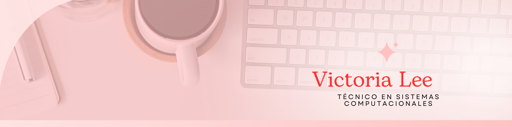

## About me...✨

- Name: Victoria Lee
- Located_in: Guadalupe, Nuevo León

### A little bit about me
I studied a technical degree in Computer Systems. I studied 7 semesters of the Actuary Degree and I am currently studying Administrative Computer Engineering. I use Excel at an Advanced level, and Macro programming in Excel.

### Languages
* Spanish C2
* English B2
* German B1

### 👩‍💻 Some Technologies I use: 

### Comunication:

 _vlee3385@gmail.com_

<!--
**VictoriaLeeAl/VictoriaLeeAl** is a ✨ _special_ ✨ repository because its `README.md` (this file) appears on your GitHub profile.

Here are some ideas to get you started:

- 🔭 I’m currently working on ...
- 🌱 I’m currently learning ...
- 👯 I’m looking to collaborate on ...
- 🤔 I’m looking for help with ...
- 💬 Ask me about ...
- 📫 How to reach me: ...
- 😄 Pronouns: ...
- ⚡ Fun fact: ...
-->
